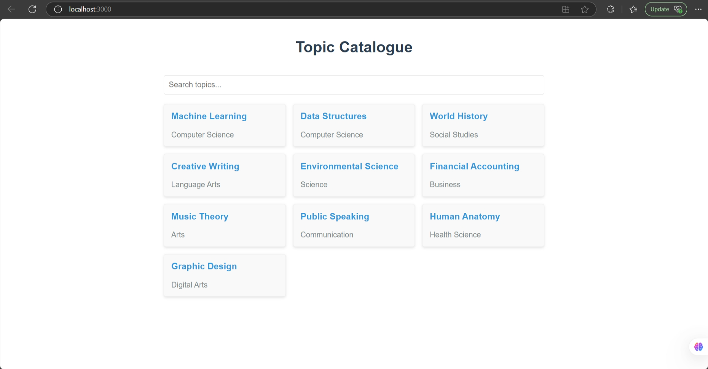

# TopicSearch - React Component



A responsive topic browser with real-time search capabilities, designed for modern catalogue management systems.

## Key Features

- Instant search - Filters topics as you type (case-insensitive)
- Clean UI - Responsive card layout with category tagging
  -Performance optimized - Efficient filtering algorithm
- Empty state handling - Clear "No topics found" messaging
- Mobile-friendly - Works on all screen sizes

## Technologies Used

- React.js (v18+)
- JavaScript (ES6+)
- CSS3 (Flexbox/Grid)

### Installation

1. Clone the repository:
   ```bash
   git clone https://github.com/dsruthi17/TopicSearch.git
   cd TopicSearch
   ```
