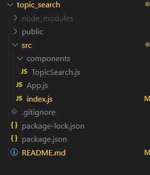

# TopicSearch - React Component


A responsive topic browser with real-time search capabilities, designed for modern catalogue management systems.

## Key Features

- Instant Search: Filters topics dynamically as you type (case-insensitive).
- Default Display: Shows all topics when the search bar is empty.
- Responsive Design: Grid-based layout that adapts to all screen sizes.
- Category Tagging: Topics are categorized for better organization.
- Empty State Handling: Displays a clear message when no topics match the search term.
- Performance Optimized: Uses efficient filtering to ensure a smooth experience.

## Technologies Used

- React.js: For building the dynamic and reusable UI components.
- JavaScript (ES6+): For logic implementation.
- CSS3 (Flexbox & Grid): For responsive and aesthetic design.

### Installation

1. Clone the repository:
   ```bash
   git clone https://github.com/dsruthi17/TopicSearch.git
   cd TopicSearch
   ```
2. Install Dependencies
   npm install

3. Start the Development Server
   npm start
4. Open in browser
   Visit http://localhost:3000

## Project Structure



## How It Works

1. Search Functionality

- The app uses useState to track the search term.
- Topics are filtered in real-time using .filter() and .includes().

2. UI Components

- Search Bar – Input field for querying topics.
- Topic Cards – Display topic name and category.
- No Results Message – Shown when no matches are found.

3. Styling

- CSS-in-JS approach for scoped styling.
- Responsive grid (display: grid) for topic cards.

## Workflow Steps

- User types in the search box.
- The searchTerm state updates.
- The app filters topics based on the input.
- Results are dynamically displayed in a grid.
- If no matches, a "No topics found" message appears.
